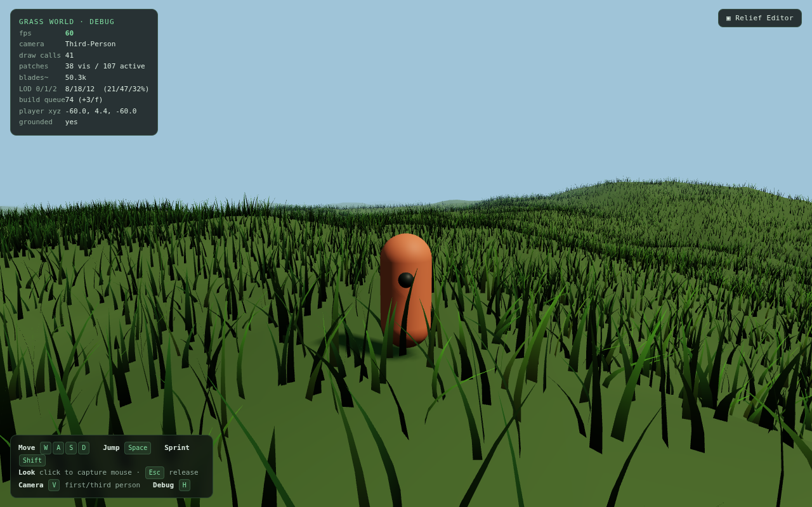

# webbroswer-assest-creator


A browser-native world builder and procedural asset studio, built on [three.js](https://threejs.org/) r0.169. Sculpt a glacial valley, scatter living wildlife and flocks across it, generate sci-fi relic weapons from a seeded grammar, place them in the world, then walk up and carry one to its cache. All in the browser. No engine install, no native toolchain.

> Status: **v0.1.0** — a tagged, playable first build. Find a generated relic weapon, equip it, carry it across a living alpine valley, and deposit it on its pedestal. The loop completes and persists across reloads.



---

## Why this exists

Most "make a game world in your browser" tools are either toy scene-graph editors or thin wrappers around a native engine. This is neither. It is a from-scratch, deterministic, content-authoring engine where:

- **Everything is data.** Worlds, prefabs, generators, weapons, interactions, objectives — all serialize to a versioned `WorldDocument`. Reload is truth.
- **Generation is seeded and reproducible.** No `Math.random()` in content paths. The same seed yields the same valley, the same flock, the same weapon, every time.
- **The runtime is honest.** What you author is what you reload. Persistence whitelists are explicit; nothing is silently dropped or invented.
- **The editor stays focused.** This is a deliberate, focused authoring tool — not an attempt to cram a native engine into a tab.

---

## Quick start

```bash
npm install
npm run dev        # Vite dev server, world builder at /
npm run build      # production build
npm run preview    # serve the production build
```

Open the dev server URL, press **▶ Play** to enter play mode, and follow the on-screen banner: find the relic, press **F** to equip it, carry it to the glowing cache zone, and press **G** to deposit it.

---

## The four studios

This project ships **four Vite entry points** (see [`vite.config.js`](vite.config.js)) — four distinct surfaces over one engine:

| Entry | File | What it is |
|---|---|---|
| World Builder | [`index.html`](index.html) | The main editor + playable runtime: terrain, water, wildlife, placement, objectives. |
| Arsenal Lab | [`arsenal.html`](arsenal.html) | A procedural sci-fi weapon studio. Roll a seed, get a weapon: grammar → geometry → material. |
| Catalog | [`catalog.html`](catalog.html) | The playable-slice front door — browse and jump straight into authored slices. |
| WebGPU Lab | [`webgpu-lab.html`](webgpu-lab.html) | An isolated WebGPU feasibility lab — a research gate, not a production renderer. |

---

## Controls

### Play mode

| Key | Action |
|---|---|
| **W A S D** | Move |
| **Space** | Jump |
| **Shift** | Sprint |
| **Mouse** | Look |
| **V** | Toggle camera view |
| **F** | Equip / drop the carried weapon |
| **R** | Cycle equip slot (right hand / back / hip) |
| **H** | Carry helper |
| **G** | Deposit the relic in the cache zone |
| **1 / 2 / 3** | Select equip slot |
| **L** | Toggle slice trace overlay |

### Debug overlays (dev build)

| Key | Action |
|---|---|
| **`** (backquote) | Toggle debug overlay |
| **B** | Toggle performance budget HUD |

---

## How it fits together

```text
WorldDocument (versioned, serializable)
│
├── terrain        TerrainProfile — one active profile is the single source of truth
│                  for mesh height, height queries, and placement grounding
├── water          lives inside the terrain contract (waterLevelAt / wetnessAt / hasWater)
├── wildlife       grounded animals + aloft flocks, streamed by region, seeded
├── ambient        motes and atmosphere over wet meadow and waterside
├── objects        placed world objects, prefabs, generated clusters
├── runtimeAssets  generated weapons — stored as recipes, rebuilt on load (never baked)
├── interactions   data-only triggers, doors, signs, pickups, spawns
└── objectives     the relic → equip → carry → deposit loop
```

Two principles hold the whole thing together:

1. **Single source of truth for terrain.** The mesh you see, the height query placement uses, and the ground wildlife and the player stand on all come from one active `TerrainProfile`. They cannot disagree.
2. **Recipes, not bakes.** Generated weapons persist as the seed + grammar that produced them, not as frozen geometry. Load rebuilds them. Change the generator, reload, and old content regenerates faithfully.

---

## Procedural systems

- **Glacial valley terrain** — an alpine glacial valley with color bands, snow/rock/dirt blending, and glacial lighting. The active profile owns height everywhere.
- **Glacial water** — rivers, lakes, and tarns derived from a single water sheet that discards dry depth. Wetness drives vegetation and ambient placement.
- **Wildlife** — grounded hares and ibex that wall-follow terrain and never wander into water, cliff, or snow; aloft snow-finch flocks with bounded cohesion and tangent scatter.
- **Ambient motes** — firefly specks over wet meadow and waterside, the first consumer of the wetness field.
- **Region streaming** — a shared, Node-testable `RegionStreamer` drives wildlife, flocks, and motes as the player moves.
- **Generators** — city, camp, ruin, forest, and connective road/plaza generators emit normal `WorldObject`s and prefab-backed clusters — no hidden scene graph.
- **Arsenal weapons** — a seeded grammar → geometry → material pipeline producing sci-fi weapons with energy shader cores and equip markers.

This is prototype-grade real-time graphics by a single developer — lush and deliberate, but not a shipping production engine. Its strength is reproducibility and structure, not raw fidelity.

---

## Combat seam

There is no combat or live firing in this build. The relic loop is non-lethal: find, equip, carry, deposit. There is no health, death, projectile, chase, or wave — the threat-aware systems present are feasibility and presentation only, not a live combat mode.

---

## Testing & verification

This is a heavily test-gated codebase. There are **102 `test:*` scripts** in [`package.json`](package.json), each pinning a specific subsystem or stage so it cannot silently regress. Nearly every feature ships with **both** a deterministic, GL-free Node regression (`scripts/*-regression.mjs`) **and** a headless browser proof (`scripts/browser-*-proof.mjs`) that boots three.js under SwiftShader (software WebGL).

```bash
npm run qa            # the aggregate quality gate (skills + layout + build + browser smoke)
npm run test:browser  # headless browser smoke (WebGL via SwiftShader)
npm run perf:report   # performance report (DEV __PERF__ hook)
```

A few representative gates:

```bash
npm run test:terrain-profile      # single-source terrain invariant
npm run test:water                # water-in-terrain contract
npm run test:wildlife             # grounded animal habitat gate
npm run test:flock                # aloft flock cohesion
npm run test:instancing           # runtime instancing identity
npm run test:first-playable-proof # the integrated first-playable loop
```

The first-playable proof is the headline gate: it drives the entire loop — load a living world, place and equip a weapon, walk (through the real movement pipeline, no teleport) to the cache, deposit, complete, reload, and assert persistence — in a single headless session with zero console errors.

> Headless WebGL runs on SwiftShader (software), so frame-time is not a GPU FPS measurement. Performance gates assert structure (draw calls, batching, triangle counts), not wall-clock frame rate.

---

## Project layout

```text
src/
├── world/              the engine: documents, terrain, water, wildlife, ambient,
│                       placement, objectives, streaming, interactions, slices
├── generators/         city / camp / ruin / forest / connector generators
├── arsenal/            the procedural weapon studio (seeded grammar → mesh → material)
├── catalog/            the playable-slice catalog surface
├── grass/ trees/ bushes/   instanced, streamed vegetation systems
├── terrain/            terrain mesh + sampling (height / slope / placement)
├── player/ physics/    capsule character, cameras, collider proxies
├── editor/             the in-browser world-building shell
├── export/             worldpack export (Node-safe, runtime-consumable)
├── animation/          rigged-GLB playback via AnimationMixer (runtime-only)
├── voxels/             editor/debug voxel lab (runtime-inert)
├── visibility/         frustum-tier visibility kernel (gates updates, never hides)
├── feasibility/        the WebGPU feasibility lab
└── main.js             editor + runtime wiring

docs/                   the charter, build gates, and per-stage design records
scripts/                test, proof, and QA harness scripts
```

---

## The in-browser editor

Open the World Builder, place primitives (cube, sphere, cylinder, plane, ramp), import a GLB/GLTF for the session, or turn a drawing/photo into a placeable relief asset. Click to place, click to select, then move / rotate / scale / duplicate / delete — with **undo/redo** and **localStorage** save/load. Placed objects carry simple collider proxies (`box`, `cylinder`, `ramp`, `plane`, `trigger`, `none`); the runtime collides against those proxies rather than the visual mesh, and solid colliders suppress grass in their footprint.

---

## Documentation

The full design history lives in [`docs/`](docs/). Highlights:

- [`docs/PROJECT_CHARTER.md`](docs/PROJECT_CHARTER.md) — the canonical engineering ledger, with **64 ADR sections** recording every significant architectural decision.
- [`docs/FIRST_PLAYABLE_BUILD.md`](docs/FIRST_PLAYABLE_BUILD.md) — the first-playable build gate: the go/no-go target for the v0.1 milestone.
- [`docs/FIRST_OBJECTIVE.md`](docs/FIRST_OBJECTIVE.md) — the relic → equip → carry → deposit objective.
- [`docs/ARSENAL_LAB.md`](docs/ARSENAL_LAB.md) — the procedural weapon studio.
- [`docs/ARSENAL_WORLD.md`](docs/ARSENAL_WORLD.md) — how generated weapons enter the world as recipes.
- [`docs/VISUAL0_TERRAIN.md`](docs/VISUAL0_TERRAIN.md) — the glacial valley terrain profile.
- [`docs/VISUAL1_WATER.md`](docs/VISUAL1_WATER.md) — the glacial water contract.
- [`docs/SLICE_AUTHORING.md`](docs/SLICE_AUTHORING.md) — the slice authoring kit.
- [`docs/PERFORMANCE_REPORT.md`](docs/PERFORMANCE_REPORT.md) — the performance validation report.
- [`docs/VISUAL_BENCHMARK.md`](docs/VISUAL_BENCHMARK.md) — the visual regression benchmark.
- [`docs/WEBGPU_FEASIBILITY.md`](docs/WEBGPU_FEASIBILITY.md) — the WebGPU feasibility study.

---

## Tech stack

- **[three.js](https://threejs.org/) r0.169** — rendering.
- **[Vite](https://vitejs.dev/) 5** — dev server and build, with four entry points.
- **Node ≥ 18** — for the test and QA harness.
- A single runtime dependency (`three`). The engine is deliberately lean.

---

## Status & license

This is **v0.1.0**, a tagged first playable. The build history spans 76 stages, tracked across 76 git tags and the ADR ledger in [`docs/PROJECT_CHARTER.md`](docs/PROJECT_CHARTER.md).

No license file is present, so the project is **source-available** and all rights are reserved by the author. If you want to use, fork, or build on it, ask first.
